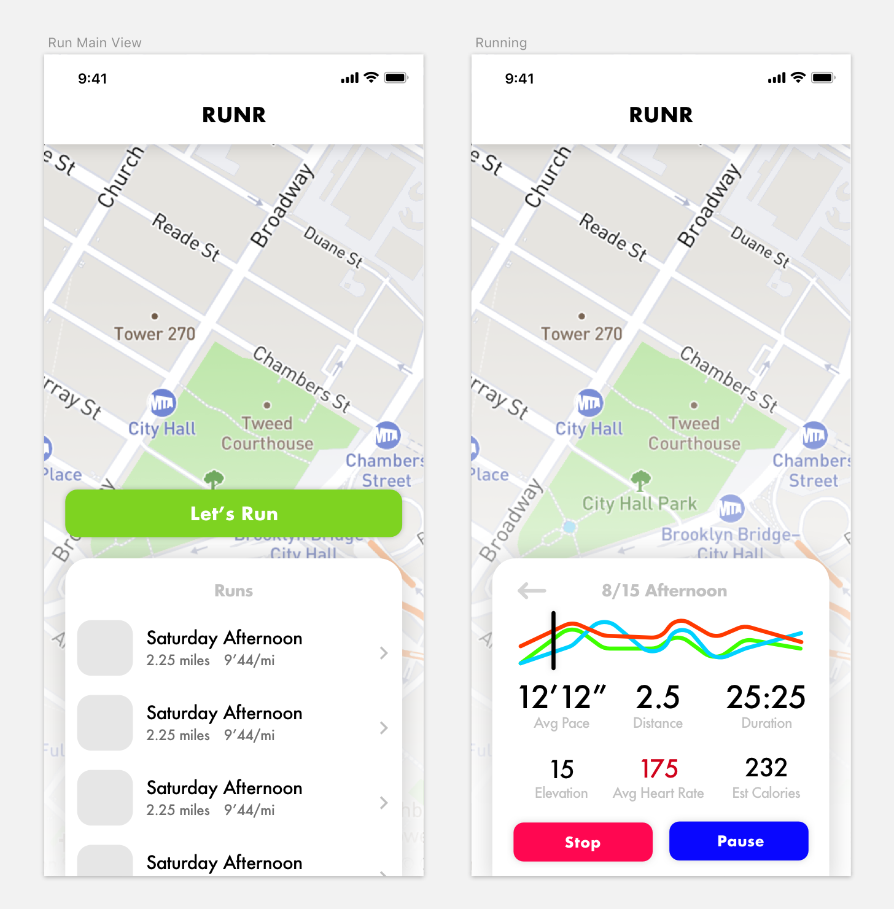

# Runr🏃🏻‍♂️

## Design

Here is the current design I have come up with for Runr. The idea is to have a very simple UI which is easy for the user to use when out for a run. Open to ideas on how to improve!

## Purpose
After becoming an active runner over the past year, I've been wanting a simpler app to manage my runs which is what I hope to accomplish with Runr. Also, I've been wanting to write an Apple Watch app for a while now which will be an integral part of the Runr experience.

## Open Source & Copying

I plan to ship Runr on the App Store for free and provide its entire source code for free as well. In the spirit of openness, Runr is licensed under MIT so that you can use my code in your app, if you choose.

However, please do not ship this app under your own account. Paid or free.

## Future plans/ ideas
- Cloud backup using CloudKit
- Pace alerts
- Siri Shortcut integrations